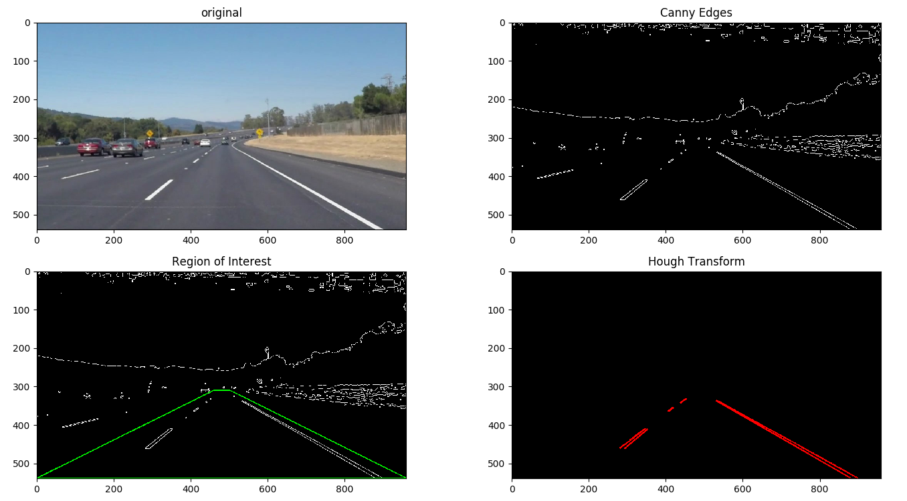
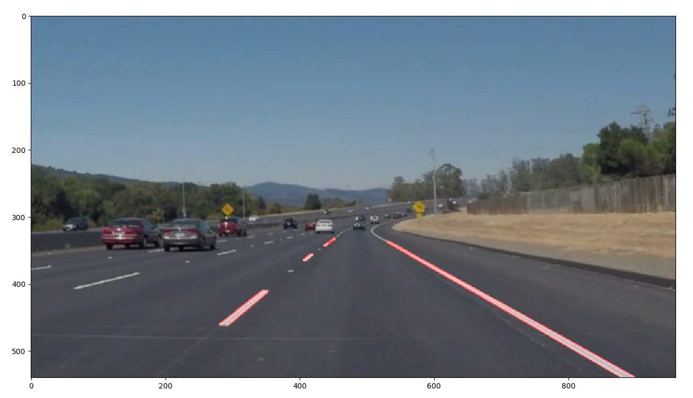

# Finding Lane Lines on the Road

---

**Finding Lane Lines on the Road**

The goals / steps of this project are the following:
* Make a pipeline that finds lane lines on the road
* Reflect on your work in a written report

### Reflection

#### 1. Describe your pipeline. As part of the description, explain how you modified the draw_lines() function.

My pipeline consisted of 5 steps.
* Step 1, Use color select to remove all pixels that are below [200,200,200]
* Step 2, Convert the image to grayscale.
* Step 3, Run gaussian blur on the grayscale image with kernel_size=3.
* Step 4, Run canny edge detector on the blured image. Parameter: low_threshold = 50, high_threshold = 100
* Step 5, Remove all edges outside of our region of interest. I defined the ROI as a trapezoid bounded by [460,310],[500,310],[959,539],[0,539].
* Step 6, Run Hough Transform to detect line segments. Parameters: rho = 1, theta = 1 degree, threshold = 10, min_line_len = 10, max_line_gap = 15
* Step 7, Use draw_lines() described below to mark the single line for left and right edge.

In order to draw a single line on the left and right lanes, I modified the draw_lines() function as follows. For each line segment generated by Hough Transform, compute its slope k = delta_y/delta_x. If k>0, it belongs to right edge. If k<0, it belongs to left edge. I ignore any horizontal or vertical edge, as well as any points that lie outside of the expected region for the corresponding edge. Then I collect all the valid points into a long array, one for the left edges and one for right edges. Finally, I do a linear regression to find the best linear fit for all the points in the array. I extend the line to the image boundary, and use the same ROI used in Step 5 to mask out the line outside our region of interest.

If youd like to include images to show how the pipeline works, here is how to include an image: 

#### 2. Identify potential shortcomings with your current pipeline

One potential shortcoming would be many parameters are hard-coded which makes generalization difficult. For example, we make assumptions about the color of lane lines and rough region of where they lie, but they may not always hold. For example, the color of lane lines may look darker on a cloudy day and the region may be different on another vehicle with a different camera.

Another shortcoming could be that the detection is only based on a single image therefore there is occasional big jumps between consecutive frames. If we can apply some temporal filtering, the detection will be much smoother.

#### 3. Suggest possible improvements to your pipeline

A possible improvement would be to do temporal filtering to smoothen the detection.

Another potential improvement could be to prepare several sets of parameters and during runtime determine which one set is the best performing one.